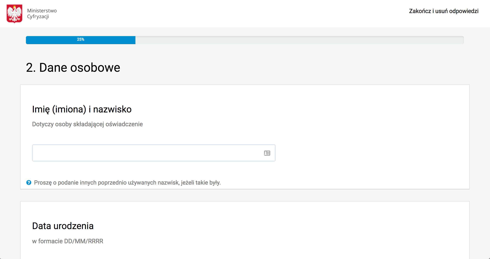

<article id="app-id-53" class="application-cart row grey">
    

        <h3>Generator oświadczeń majątkowych</h3>
        

            
Generator oświadczeń majątkowych ułatwia składanie dokumentu przez osoby na stanowiskach państwowych (administracja publiczna), samorządowców oraz parlamentarzystów. Wypełnienie formularza w kilku krokach ułatwia
                uzupełnienie oświadczenia, pozwala na użycie go w przyszłości bez konieczności ponownego wpisywania danych oraz zwiększa transparentność działań administracji. Oświadczenie wypełniane on-line jest bezpieczne
                i nie przechowuje danych. Zabezpieczenia gwarantuje NASK.
              

        

        

            
 <a href="generator.html">WYPEŁNIJ OŚWIADCZENIE</a> 

        

    

    

        
    

</article>
